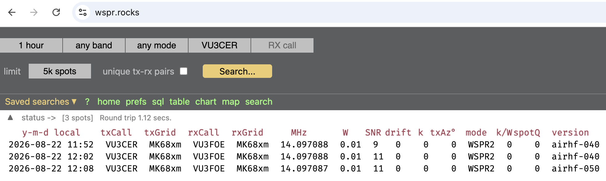

# airspyhf-wsprd

A WSPR/FT8 receiver for the **Airspy HF+ Discovery** SDR, with automatic
WSPRnet and PSK Reporter uploads.

It tunes, aligns to even UTC minutes, receives, decodes, reports, and repeats.

Get fully started in one command and less than 5 minutes!

## Automatic Install

Debian, Ubuntu, or Raspberry Pi OS, with mode, callsign, grid, and hopping
prompts:

```sh
curl -fsSL -H 'Cache-Control: no-cache' "https://raw.githubusercontent.com/kholia/airspyhf-wsprd/master/install.sh?$(date +%s)" | sudo bash
```

This builds, tests, enables automatic WSPRnet or PSK Reporter reporting, and
starts the RAM-only systemd service. It confirms the mode and station details,
then asks whether to enable adaptive band hopping. Running it again updates the
installer-managed checkout to `origin/master`, discarding divergent local
commits or tracked changes under `/opt/airspyhf-wsprd`.

On an ARM64 Raspberry Pi, the installer also verifies and extracts `jt9` from
the WSJT-X Improved Raspberry Pi package. FT8 then runs `ft8_lib` and
`jt9 --ft8 -M -C 2 -m 2` concurrently and reports their deduplicated union.
Per-frame WAV, decoder output, wisdom, and temporary files stay under `/run` in
RAM. Other systems continue to use the built-in `ft8_lib` decoder.

## Manual Linux installation [OPTIONAL]

```sh
sudo apt update
sudo apt install build-essential pkg-config libairspyhf-dev libcurl4-openssl-dev
make
make test
```

If `libairspyhf-dev` is unavailable, install Airspy's official
[`airspyhf`](https://github.com/airspy/airspyhf) source:

```sh
sudo apt install git cmake libusb-1.0-0-dev
git clone https://github.com/airspy/airspyhf.git
cmake -S airspyhf -B airspyhf/build -DINSTALL_UDEV_RULES=ON
cmake --build airspyhf/build
sudo cmake --install airspyhf/build
sudo ldconfig
```

Replug the receiver afterward.

macOS:

```sh
brew install airspyhf
make
make test
```

## Run

Check that the receiver is visible:

```sh
airspyhf_info
```

Test on 20 metres without uploading (`-n`):

```sh
./airspyhf-wsprd -b 20m -c YOURCALL -g YOURGRID -n
```

Enable automatic WSPRnet reporting by removing `-n`:

```sh
./airspyhf-wsprd -b 20m -c YOURCALL -g YOURGRID
```

Run FT8 on its standard 20m dial frequency and report to PSK Reporter:

```sh
./airspyhf-wsprd --mode FT8 -b 20m -c VU3CER -g MK68xm
```

Decoded spots are printed and uploaded automatically. Stop with `Ctrl-C`.
Keep the computer clock accurately synchronized; the first result takes about
two minutes. Temporary upload failures are retained in a bounded RAM queue and
retried without blocking reception.

Verify the bundled recording and all nine expected decodes:

```sh
make test-wav
make test-ft8
```

Cross-check the complete build and test suite with Ubuntu, GCC, and glibc:

```sh
make test-ubuntu
```

This uses `ubuntu:latest`, mounts the source read-only, and keeps container
build artifacts in tmpfs.

Build, flash, and arm the optional ESP32-S3/Si5351 hardware test generator:

```sh
make esp32-flash PORT=/dev/cu.usbmodemXXXX
make esp32-arm PORT=/dev/cu.usbmodemXXXX
```

See [`test-hw/README.md`](test-hw/README.md) for wiring and the full real-RF
decode test. The generator remains RF-silent until the arming command sends
`*tx*` at an even UTC boundary.

## Bands

```text
2200m  630m  160m  80m  60m  40m  30m  20m
17m    15m   12m   10m  4m   2m   1.25m
```

`LF` and `MF` alias `2200m` and `630m`. The HF+ tuner gap excludes 6 metres.
Use `-f 14.0956M` instead of `-b` for a manual dial frequency.
Band presets select mode-specific dial frequencies, such as 14.0956 MHz for
WSPR and 14.074 MHz for FT8 on 20m.

Adaptive band hopping:

```sh
./airspyhf-wsprd -B auto -c VU3CER -g MK68xm
./airspyhf-wsprd --mode FT8 -B auto -c VU3CER -g MK68xm
```

FT8 changes band every 2 minutes; WSPR changes every 10 minutes. WSPR ranks
regional activity with wspr.live.
FT8 ranks PSK Reporter's active-monitor counts by band, using its
[best-frequency service](https://pskreporter.info/cgi-bin/psk-freq.pl) as a
small regional fallback. At startup it immediately obtains and activates
advice before the first capture, with a bounded 45-second wait. Every sixth
hop explores another band, so FT8 explores every 12 minutes and WSPR every
hour. Network failures keep the local
`80m,40m,30m,20m,17m,15m,12m,10m` schedule. Use
`-B 80m,40m,20m,10m` for a fixed offline schedule. Every capture snapshots its
dial frequency, so reports remain correct after later retunes. All state stays
in RAM.

## Common options

```text
--mode MODE WSPR or FT8 (default WSPR)
-n          disable WSPRnet and PSK Reporter uploads
-B auto     adaptive hopping (FT8: 2 minutes; WSPR: 10 minutes)
-s SERIAL   select a receiver
-r RATE     override the 192k sample-rate default
-l 0|1      HF+ preamp off/on (default on)
-A 0|1      analog AGC off/on (default on)
-t 0|1      AGC threshold low/high (default high)
-p HZ       frequency correction
-e ADDRESS  health HTTP bind address (default 0.0.0.0)
-P PORT     health HTTP port (default 8080; 0 disables)
-h          complete help
```

The production defaults of AGC on, high threshold, and preamp on favor maximum
weak-signal sensitivity. Use `-l 0` at unusually strong-signal sites if needed.
The 192 ksample/s input is decimated to
the same 375 sample/s WSPR stream as higher rates, so it reduces USB load
without reducing decoder bandwidth or sensitivity.

Read machine status from another computer with:

```sh
curl http://RECEIVER-IP:8080/health
```

The endpoint is read-only, accepts only `GET /health`, has no control API, and
never writes state to disk. Its indented JSON includes the active mode,
reporting network, clock, receiver, decoder, selected and tuned bands, hopping,
overruns, spots, and RAM upload queue. In FT8 mode it also compares the last,
total, and average decode counts from `ft8_lib` and `jt9`. Healthy reception
returns HTTP 200;
clock or runtime faults return HTTP 503. It listens on all IPv4 interfaces by
default. Restrict access with the host firewall, set `HEALTH_BIND=127.0.0.1` for
local-only monitoring, or set `HEALTH_PORT=0` to disable it.

For a live health and propagation snapshot:

```sh
make diagnose-live
```

The defaults target `rpi.local`, VU3CER, and MK68xm. Override them when needed,
for example `make diagnose-live RX_CALL=K1TE WSPR_LAT=... WSPR_LON=...`.

Optional system-wide installation:

```sh
sudo make install
```

## Start automatically on Linux

For an unattended systemd installation:

```sh
sudo ./scripts/install-systemd.sh
sudoedit /etc/default/airspyhf-wsprd
sudo systemctl start airspyhf-wsprd
sudo journalctl -u airspyhf-wsprd -f
sudo systemctl enable airspyhf-wsprd
```

Set `MODE=FT8` in `/etc/default/airspyhf-wsprd` to run FT8. Adaptive hopping
uses the activity source appropriate to the selected mode.

The service restarts after USB faults and starts after reboot or power recovery.
If the SDR is disconnected, systemd retries every 15 seconds without an
attempt limit; installation still completes normally.
Uploads remain disabled until you enter your real callsign/grid and remove `-n`
from `REPORTING`. During reception, decoder state and bounded journal logs stay
in RAM under `/run`; FT8 `jt9` input and output also remain there. The receiver
makes no microSD writes while running. For field hardware
and soak-test guidance, see
[`docs/industrial-grade.md`](docs/industrial-grade.md).

## Demo

```
% ./airspyhf-wsprd -b 20m -c VU3CER -g MK68xm
HF+ sample rates: 768000 384000 256000 192000 Hz

Starting airspyhf-wsprd (2026-08-22, 06:12z) - Version 0.9
  Mode         : WSPR
  Callsign     : VU3CER
  Locator      : MK68xm
  Band         : 20m
  Dial freq.   : 14095600 Hz
  IQ center    : 14097100 Hz
  Rate         : 192000 Hz
  Decimation   : 512
  HF AGC       : yes
  AGC threshold: high
  Attenuation  : 0 dB (ignored while AGC is enabled)
  Preamp       : yes
  WSPRnet      : upload enabled
  Health HTTP  : http://0.0.0.0:8080/health
  S/N          : <something>
Wait for time sync (start in 97 sec)

Spot : 40.00 -2.00  14.097088  0  VU3CER MK68 10
```



BAM!

## Upstreams

The WSPR core tracks [`kholia/wsprd`](https://github.com/kholia/wsprd/tree/main).
The vendored FT8 decoder tracks [`howard0su/ft8_lib`](https://github.com/howard0su/ft8_lib)
at the exact commit in [`ft8_lib/UPSTREAM_COMMIT`](ft8_lib/UPSTREAM_COMMIT).
PSK Reporter packets follow its
[`IPFIX/UDP protocol`](https://pskreporter.info/pskdev.html), informed by the
[`SunshineFT8 reference`](https://github.com/kholia/SunshineFT8/blob/master/pskreporter.cpp).

## Resources

- https://wspr.live/

- https://wspr.rocks/

- https://pskreporter.info/pskmap?callsign=VU3CER&search=Find
